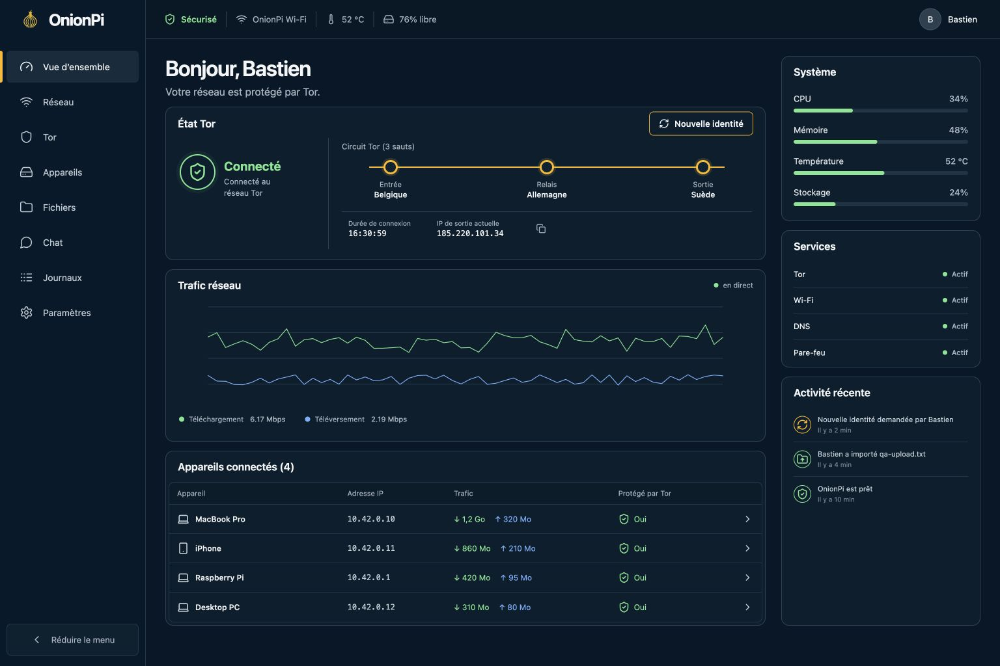

# OnionPi — routeur Tor pour Raspberry Pi

[](https://github.com/0xmagicduck/onionpi-router/actions/workflows/ci.yml)
[](https://github.com/0xmagicduck/onionpi-router/actions/workflows/release.yml)
[](LICENSE)

OnionPi transforme une Raspberry Pi en point d’accès Wi‑Fi dont le trafic TCP
et les requêtes DNS passent par Tor. L’administration se fait depuis une
interface web locale avec état Tor, circuit courant, trafic, appareils,
partage de fichiers, chat et journaux système.



L’interface suit un système de design unique (jetons de couleur, d’espacement
et de typographie dans `frontend/src/styles/`), s’affiche en thème clair ou
sombre selon le réglage du système ou votre choix, et se pilote entièrement au
clavier — `Ctrl`/`Cmd` + `K` ouvre la palette de commandes, `?` liste les
raccourcis.

## Ce qui fonctionne

- point d’accès WPA2 géré par NetworkManager, en 2,4 ou 5 GHz ;
- redirection transparente du TCP vers le `TransPort` de Tor ;
- DNS local (`dnsmasq`) dont l’unique résolveur amont est le `DNSPort` Tor ;
- coupe-circuit nftables : aucun paquet client n’est routé directement ;
- point d’accès lié au coupe-circuit : un échec nftables garde le Wi-Fi client
  hors ligne au lieu de le laisser démarrer sans protection ;
- pare-feu en liste blanche côté Wi-Fi : seuls DHCP, DNS, mDNS, HTTP(S), le
  `TransPort` et, au choix, SSH atteignent la Pi ;
- IPv6 désactivé sur le point d’accès pour éviter une sortie hors Tor ;
- administration HTTPS locale, session HttpOnly, CSRF et limitation des essais ;
- état de protection unique qui distingue démonstration, dégradation sûre,
  confinement et protection complète ;
- assistant de première ouverture : mot de passe, interfaces, test du
  coupe-circuit, horloge et code de récupération ;
- récupération locale limitée dans le temps par `onionpi-maintenance`, sans
  SSH ni porte de secours permanente ;
- centre de données virtuel : clients du Wi-Fi et machines distantes rangés
  dans des emplacements avec ports et câbles persistants, plan de contrôle du
  fabric Tor, inventaire des services, alertes et test groupé des agents ;
  l’agent installable force la sortie d’un VPS par Tor et n’est joignable que
  par service onion ;
- nouvelle identité Tor depuis l’interface ;
- ponts et transports enfichables (Snowflake, obfs4, meek) avec bascule
  automatique quand Tor est bloqué ;
- hébergement optionnel d’un proxy Snowflake au bénéfice des personnes censurées ;
- filtrage DNS des publicités, traqueurs et domaines choisis, listes
  téléchargées à travers Tor ;
- blocage d’un appareil par adresse MAC, appliqué par nftables ;
- accès des appareils : nom donné par le foyer, pause de 15 min à 8 h et plage
  horaire quotidienne par jour de la semaine, appliqués par le même
  coupe-circuit ;
- trafic compté par appareil, cumulé à partir des compteurs nftables ;
- audit de sécurité : treize contrôles de durcissement notés, classés par
  urgence, avec le geste qui corrige chacun ;
- pays du relais de sortie et rotation d’identité programmée ;
- mesure du débit réel à travers le circuit courant ;
- service onion optionnel pour joindre l’interface depuis l’extérieur, avec
  autorisation client v3 pour que l’adresse seule ne suffise plus ;
- redémarrage des services, redémarrage/extinction de la Pi et sauvegarde
  chiffrée/restauration avec aperçu depuis l’interface ;
- diagnostic local de santé (SQLite, stockage, services, Tor, horloge et
  fichiers système), accompagné de remèdes et exportable en JSON ;
- métriques CPU, mémoire, température, disque et débit réseau ;
- liste des clients DHCP/ARP ;
- fichiers confinés à `/var/lib/onionpi/shared`, avec import, téléchargement,
  dossiers et suppression non récursive ;
- chat LAN persistant dans SQLite et mis à jour par WebSocket ;
- lecture des journaux Tor, réseau, DHCP, pare-feu et application ;
- console de la Pi habillée : bannière ASCII au démarrage et à la connexion,
  message du jour avec l’état réel, invite de commande et `onionpi-status` ;
- mise à jour automatique aux heures choisies, téléchargée par Tor, vérifiée
  par empreinte/signature, installée hors ligne dans une version immuable et
  annulée toute seule si le contrôle post-installation échoue ou est interrompu.

## Matériel et système

- Raspberry Pi 4 ou 5, 2 Go de RAM minimum ;
- Raspberry Pi OS Lite 64 bits Bookworm ou Trixie, idéalement fraîchement installé ;
- Ethernet (`eth0`) relié à la box/au modem ;
- Wi‑Fi intégré (`wlan0`) utilisé comme point d’accès.

Une seule radio Wi‑Fi ne doit pas servir à la fois de connexion amont et de
point d’accès. Pour un WAN Wi‑Fi, ajoutez un adaptateur USB et passez son nom à
`--wan`.

## Image prête à flasher

`packaging/image/build-image.sh` produit une image Raspberry Pi OS qui installe
OnionPi toute seule au premier démarrage. Elle fonctionne sur macOS et Linux,
sans droits root.

```bash
./packaging/image/build-image.sh --hostname onionpi --country BE
```

Le script télécharge Raspberry Pi OS Lite 64 bits, y injecte le projet et une
séquence de premier démarrage, puis écrit `build/onionpi-<date>.img`, son
empreinte SHA-256 et un fichier `…-identifiants.txt` en `0600`. Ce fichier est
le seul endroit où les mots de passe existent en clair : rangez-le dans un
gestionnaire de mots de passe puis supprimez-le.

Le téléchargement officiel est vérifié avec son document SHA-256. Avec
`--source`, fournissez aussi `--source-sha256` (ou
`ONIONPI_BASE_SHA256`) : une image de base non authentifiée est refusée.

Options utiles :

| Option | Effet |
| --- | --- |
| `--ssid NOM` | nom du Wi-Fi publié par la Pi |
| `--band a --channel 36` | point d’accès en 5 GHz |
| `--login NOM` | compte système créé sur la Pi (défaut `onionpi`) |
| `--ssh-key ~/.ssh/id_ed25519.pub` | clé publique installée sur ce compte |
| `--no-lan-ssh` | interdit SSH depuis le Wi-Fi OnionPi |
| `--compress` | produit aussi une archive `.img.xz` |
| `--source CHEMIN` | réutilise une image de base déjà téléchargée |
| `--source-sha256 EMPREINTE` | authentifie une image de base personnalisée |

Pour choisir vos propres mots de passe plutôt que ceux générés :

```bash
ONIONPI_WIFI_PASSWORD='phrase-wifi-longue' \
ONIONPI_ADMIN_PASSWORD='phrase-admin-longue' \
ONIONPI_LOGIN_PASSWORD='phrase-systeme-longue' \
  ./packaging/image/build-image.sh
```

Flashez ensuite avec Raspberry Pi Imager (« Utiliser une image personnalisée »)
ou `sudo dd if=build/onionpi-<date>.img of=/dev/rdiskN bs=4m`.

Ne montez pas l’image sur macOS pour l’inspecter : le Finder écrit
`.fseventsd` et `.Spotlight-V100` dans la partition de démarrage, ce qui
invalide l’empreinte SHA-256. Utilisez `hdiutil attach -readonly` si vous devez
regarder à l’intérieur.

**Premier démarrage.** Branchez la Pi en Ethernet : elle a besoin d’Internet
pour installer ses paquets. Elle redémarre une fois, installe OnionPi (10 à
20 minutes selon la carte SD), puis publie le Wi-Fi. Suivez l’avancement par
SSH avec `sudo tail -f /var/log/onionpi-firstboot.log`, ou relancez
l’installation avec `sudo systemctl start onionpi-firstboot` si le réseau
manquait.

L’image ne contient aucun mot de passe en clair : seulement le PSK Wi-Fi
dérivé, le condensat scrypt du compte web et le condensat SHA-512 du compte
système. Le PSK reste équivalent au mot de passe Wi-Fi pour qui possède la
carte SD ; traitez une carte perdue comme un identifiant compromis.

## Installation manuelle

Gardez un accès local (écran/clavier ou Ethernet) pendant la première
installation : la connexion actuelle de `wlan0` sera remplacée.

```bash
cd onionpi-router
sudo ./packaging/install.sh --wan eth0 --wifi wlan0 --country BE
```

Ajoutez `--band a --channel 36` pour un point d’accès en 5 GHz, et
`--no-lan-ssh` pour refuser SSH depuis le Wi-Fi OnionPi.

L’installateur demande deux mots de passe différents, de 12 caractères
minimum : le WPA2 du point d’accès et le compte web `admin`. Ils ne sont pas
acceptés en argument pour ne pas apparaître dans l’historique du shell.

Pour une installation automatisée :

```bash
sudo env \
  ONIONPI_WIFI_PASSWORD='une-phrase-wifi-longue' \
  ONIONPI_ADMIN_PASSWORD='une-phrase-admin-longue' \
  ./packaging/install.sh --yes --country BE
```

Ensuite :

1. connectez un appareil au réseau `OnionPi Wi-Fi` ;
2. ouvrez `https://onionpi.local` ou `https://10.42.0.1` ;
3. acceptez une fois le certificat local auto-signé ;
4. connectez-vous avec `admin` et le mot de passe choisi.

Le certificat est auto-signé parce que l’interface n’a pas de nom de domaine
public. Vérifiez son empreinte depuis la Pi si vous voulez exclure une
interception lors de la première connexion :

```bash
openssl x509 -in /etc/onionpi/tls/onionpi.crt -noout -fingerprint -sha256
```

## Contourner un blocage de Tor

La page **Contournement** de l’interface règle la façon dont Tor rejoint le
réseau. Trois modes :

| Mode | Comportement |
| --- | --- |
| Connexion directe | aucun pont, le plus rapide là où Tor n’est pas filtré |
| Automatique | surveille le démarrage de Tor et bascule seul sur un pont s’il reste bloqué |
| Pont choisi | vous imposez un transport, et vos propres lignes de pont si vous en avez |

En mode automatique, OnionPi laisse d’abord Tor démarrer normalement. Si le
bootstrap reste sous 100 % pendant deux à trois minutes, il active le transport
recommandé pour le pays, puis passe au suivant si celui-ci ne débloque rien. Un
pays connu pour filtrer Tor (Chine, Iran, Russie, Biélorussie, Égypte, Birmanie,
Turkménistan, Hong Kong) démarre directement sur des ponts, sans attendre
l’échec. Le pays vient du code réglementaire Wi-Fi donné à l’installation
(`--country`) et se change depuis l’interface ; il n’est envoyé à personne.

Transports disponibles :

- **Snowflake** — rebond WebRTC par des volontaires, aucun pont à demander.
  C’est le choix par défaut, et le seul qui fonctionne sans obtenir d’adresses.
- **obfs4** — brouillage du trafic. Rapide, mais les ponts publics intégrés sont
  souvent déjà bloqués là où la censure est sérieuse : préférez des ponts privés.
- **meek** — Tor déguisé en trafic vers un CDN. Lent et coûteux, dernier recours.

Pour des ponts privés, demandez-les sur <https://bridges.torproject.org> ou par
courriel à `bridges@torproject.org` (depuis Gmail ou Riseup), puis collez les
lignes dans le champ prévu. Une ligne par pont, transport compris. Le bouton
« Actualiser la liste de ponts » rafraîchit les ponts intégrés depuis
torproject.org ; il échoue là où ce domaine est bloqué, et la liste fournie avec
OnionPi prend alors le relais.

Sous le capot, l’interface écrit `/etc/onionpi/tor/bridges.conf` — le seul
fichier hors de `/var/lib/onionpi` qu’elle peut modifier — puis demande à Tor de
relire sa configuration par le port de contrôle. Une configuration refusée est
annulée automatiquement. Vous pouvez lire le résultat :

```bash
sudo cat /etc/onionpi/tor/bridges.conf
```

## Héberger un proxy Snowflake

Depuis la même page, la Raspberry Pi peut devenir un proxy Snowflake : elle
prête sa connexion pour que des personnes censurées atteignent un pont Tor.

- ce n’est **pas** un relais Tor ni un nœud de sortie : aucun site tiers ne voit
  votre adresse IP, et rien de ce qui transite n’est attribuable à cette
  machine ;
- le trafic consomme votre bande passante et votre fournisseur d’accès voit des
  connexions WebRTC vers des adresses variées ;
- dans un pays où l’usage de Tor est réprimé, ne l’activez pas.

L’option n’apparaît que si le paquet Debian `snowflake-proxy` est installé, et
elle est arrêtée par défaut. Le service web ne pilote pas systemd directement :
il écrit `/var/lib/onionpi/relay.state`, et l’unité `onionpi-relay.path` fait le
`systemctl start`/`stop` à sa place. Les journaux du proxy sont lisibles depuis
la page Journaux, ou avec :

```bash
sudo journalctl -u snowflake-proxy -n 100 --no-pager
```

## Protection des clients

La page **Protection** réunit deux mécanismes qui agissent avant Tor.

**Filtrage DNS.** Les domaines choisis sont résolus vers `0.0.0.0` pour tous les
appareils du Wi-Fi. Quatre listes sont proposées (publicités et traqueurs,
traqueurs sociaux, jeux d’argent, contenus pour adultes), auxquelles s’ajoutent
vos propres domaines bloqués et une liste d’exceptions qui l’emporte toujours.
Les listes sont téléchargées **par le port SOCKS de Tor** : personne n’apprend
que cette maison les récupère. Le résultat est écrit dans
`/etc/onionpi/dns/block.hosts`, puis dnsmasq est rechargé par `SIGHUP`, sans
perdre les baux DHCP.

**Blocage d’appareils.** Un client bloqué disparaît complètement du routeur :
`/var/lib/onionpi/blocked-macs.txt` alimente le jeu nftables `blocked_clients`,
et la règle tombe en `prerouting`, avant même le DHCP. Comme un appareil bloqué
cesse de répondre à l’ARP, il reste affiché dans la liste pour pouvoir être
débloqué. Le jeu est repeuplé après chaque rechargement du pare-feu et à chaque
démarrage du service.

```bash
sudo nft list set inet onionpi blocked_clients
grep -c '^0\.0\.0\.0 ' /etc/onionpi/dns/block.hosts
```

**Trafic par appareil.** Le pare-feu compte les octets de chaque client dans
deux jeux nftables dynamiques, `client_upload` (par adresse MAC) et
`client_download` (par adresse IP, la MAC de destination n’étant pas encore
connue en `postrouting`). Lire ces compteurs demande `CAP_NET_ADMIN`, que
l’application n’a pas : `onionpi-accounting.timer` en publie un relevé toutes
les 15 secondes dans `/var/lib/onionpi-privileged/traffic.json`, que
l’interface se contente de lire. **Aucun verbe privilégié n’a été ajouté** —
une lecture n’est pas une action.

Un rechargement des règles recrée les jeux vides. L’interface conserve donc le
relevé précédent et n’ajoute que la différence : les totaux affichés survivent
à un redémarrage du pare-feu, de la Pi ou du service. Le bouton « Remettre les
compteurs à zéro » de la page **Protection** est le seul geste qui les efface.

```bash
sudo nft list set inet onionpi client_upload
systemctl list-timers onionpi-accounting.timer
```

## Accès des appareils

La page **Appareils** ajoute au blocage définitif deux réglages qui répondent
aux vraies demandes d’un foyer : « coupe la tablette une heure » et « plus
d’Internet sur la console après 21 h ».

- **Nom.** Le nom donné ici remplace partout celui annoncé par le fabricant.
- **Pause.** De 15 minutes à 8 heures. Elle expire toute seule, y compris après
  un redémarrage de la Pi : c’est l’échéance qui est stockée, pas un minuteur.
- **Plage horaire.** Une plage autorisée par jour de la semaine. En dehors,
  l’appareil est coupé exactement comme s’il était bloqué. Une plage dont la fin
  précède le début — 22:00 – 06:00 — appartient à la nuit du jour choisi.

Le calcul reste dans l’application : un fil recalcule toutes les 20 secondes
l’ensemble des adresses MAC à couper (blocages manuels ∪ pauses ∪ hors plage) et
le remet à `DeviceGuard`, qui reste le seul écrivain de `blocked-macs.txt` et le
seul appelant de l’agent privilégié. **Aucun verbe root n’a été ajouté pour
cette fonctionnalité** : côté pare-feu, une plage horaire est un blocage
ordinaire qui arrive et repart tout seul.

Les règles font partie de l’export de configuration et des sauvegardes
chiffrées. Une pause n’y est jamais restaurée : c’est une intention de quelques
minutes, pas un réglage.

## Baie virtuelle

La page **Baie virtuelle** donne à l’ensemble une vue de salle machine : des
cadres, des emplacements numérotés en U, une machine par emplacement, une
feuille de règles par machine. Elle couvre deux mondes.

- **Les clients du Wi-Fi** y entrent tels quels. Les ranger dans une baie
  n’ajoute aucun chemin d’application : leurs règles sont déléguées au
  pare-feu et à l’ordonnanceur d’accès qui les appliquaient déjà.
- **Les machines distantes** — un VPS, un serveur, une seconde Pi — y entrent
  en installant l’agent de [`packaging/agent/`](packaging/agent/README.md).
  L’agent n’écoute que sur sa boucle locale ; ce qui le rend joignable est son
  propre service onion v3, chiffré pour la clé de cette baie. **Aucun port
  n’est ouvert sur Internet**, et la baie le joint à travers Tor.

Sur un nœud distant, la règle par défaut interdit toute sortie qui ne passe pas
par le démon Tor : une application qui ignore le proxy échoue au lieu de fuir.
Le port 22 reste joignable en entrée, parce qu’un serveur distant sans porte
d’entrée ne se répare pas. L’isolement d’un nœud lui retire en plus l’accès au
port SOCKS local : il reste administrable, il ne sort plus.

Deux verrous indépendants protègent le canal — l’autorisation client onion, qui
rend l’adresse irrésoluble sans la clé, et une signature HMAC sur chaque appel,
avec refus des horodatages décalés et des nonces déjà vus. **Aucun secret n’est
stocké** : le jeton d’un nœud et sa clé sont dérivés d’un secret maître, de
l’identifiant du nœud et d’un compteur ; renouveler un nœud est un incrément, et
un export de configuration ne contient aucune identification de nœud.

Les verbes qu’un nœud accepte sont énumérés et revalidés des deux côtés : état,
nouvelle identité Tor, redémarrage de Tor, lecture d’un journal d’une unité
listée, redémarrage. Il n’y a pas de shell distant, et aucun verbe ne prend de
commande en argument.

Une baie de dix machines se tient à la main : une feuille de règles peut être
nommée en profil et rejouée sur une sélection entière, les clients du Wi-Fi
qu’aucune fiche ne décrit sont proposés à l’ajout avec le nom de leur bail, et
chaque fiche porte sa disponibilité sur 24 h — la part des sondages qui ont
répondu — ainsi que les points d’attention que ses propres lectures justifient.
Détails dans [`docs/rack.md`](docs/rack.md).

## Audit de sécurité

La page **Audit** répond à une question que le diagnostic ne pose pas. Le
diagnostic dit « est-ce que ça marche encore » ; l’audit dit « est-ce que ça
mérite encore d’être approuvé ». Un service peut être en parfaite santé et
pourtant exposer SSH à tous les invités du Wi-Fi, tourner avec un mot de passe
posé il y a deux ans, ou publier une adresse onion que toute personne l’ayant
lue une fois peut encore joindre.

Treize contrôles sont notés, du plus grave au plus anodin : mode démonstration
sur une installation réelle, coupe-circuit, canal d’actions privilégiées, SSH
depuis le Wi-Fi, âge du mot de passe, durée des sessions, mises à jour
automatiques et version installée, service onion sans autorisation client,
filtrage DNS, pays de sortie imposé, rotation d’identité, horloge, stockage et
certificat local. Chaque point à corriger porte le geste qui le règle et, quand
l’action existe déjà comme verbe privilégié, le bouton qui l’exécute.

Le rapport ne contient **aucun secret, aucun domaine visité et aucune adresse de
client** : il décrit la configuration, jamais l’usage. C’est ce qui permet de
l’exporter en JSON et de le montrer à quelqu’un pour obtenir de l’aide.

## Réglages Tor avancés

La page **Tor** ajoute, sous l’état du circuit :

- **Pays du relais de sortie.** Écrit `ExitNodes {xx}` et `StrictNodes 1` dans
  `/etc/onionpi/tor/policy.conf`, puis recharge Tor. Utile quand un service
  refuse les connexions étrangères ; à éviter au quotidien, car cela réduit la
  taille du groupe dans lequel vous vous fondez et ralentit la navigation.
- **Rotation d’identité.** Un `SIGNAL NEWNYM` à intervalle régulier (15 min à
  24 h). Les connexions déjà ouvertes ne sont pas coupées.
- **Débit réel.** Télécharge 3 Mo par le circuit courant et affiche le débit et
  la latence. La bande passante est offerte par des bénévoles : trois mesures
  par tranche de deux minutes au maximum.
- **Circuits ouverts.** Ce que Tor maintient réellement, pas seulement le
  circuit affiché en haut de page.

## Accès à distance par service onion

Ouvrir un port sur la box annonce la Pi à tout Internet. Le service onion fait
l’inverse : Tor transporte la connexion, rien n’écoute côté WAN, et l’adresse
n’est connue que de qui la détient.

L’adresse est créée par `ADD_ONION` sur le port de contrôle, donc la clé privée
reste dans `/var/lib/onionpi/onion.key` en `0600` et aucun répertoire root n’est
nécessaire. Tor oublie les services détachés quand il redémarre : l’application
republie la même clé à son démarrage. Le bouton « Générer une nouvelle adresse »
jette la clé et en crée une autre — l’ancienne adresse devient inutilisable.

Ouvrez l’adresse dans le navigateur Tor. Sans autorisation client, **elle vaut
un mot de passe** : qui la connaît atteint la page de connexion. Sur `.onion`,
le cookie de session est posé sans l’attribut `Secure`, car tous les navigateurs
ne traitent pas encore `http://…onion` comme une origine sûre ; le chiffrement
de bout en bout est assuré par Tor lui-même.

### Autorisation client (v3)

Une adresse voyage : historique, marque-pages, capture d’écran, message envoyé
à la mauvaise personne. L’autorisation client supprime ce risque. Pour chaque
appareil autorisé, l’interface tire une paire de clés x25519, ne garde que la
moitié publique et republie le service avec `ClientAuthV3`. Tor chiffre alors le
descripteur pour ces clés seules : sans la sienne, un visiteur ne peut même pas
**résoudre** l’adresse, encore moins voir la page de connexion.

La clé privée est affichée **une seule fois**, dans la ligne exacte que le
navigateur Tor attend :

```
<adresse-sans-.onion>:descriptor:x25519:<clé privée base32>
```

Enregistrez-la dans `<profil>/tor/onion-auth/<nom>.auth_private`, puis relancez
le navigateur. Perdre la clé ne coûte qu’un accès à recréer ; révoquer un
appareil est immédiat et n’affecte pas les autres. L’administration depuis le
Wi-Fi local n’est jamais concernée : elle ne passe pas par l’adresse onion.

## Mises à jour automatiques

Une Pi installée chez quelqu’un doit recevoir les correctifs sans SSH. OnionPi
demande donc lui-même, aux heures que vous choisissez, s’il existe une version
plus récente — et rien n’est jamais poussé vers l’appareil : aucun port n’est
ouvert, le dépôt n’a aucun accès à la Pi.

```bash
onionpi-update --status            # version installée, disponible, prochaine vérification
sudo onionpi-update --check        # cherche maintenant, n'installe pas
sudo onionpi-update --apply        # installe maintenant
sudo onionpi-update --rollback     # revient à la sauvegarde précédente
```

La page **Paramètres** règle le canal, l’heure et l’installation automatique.
En ligne de commande, la politique est dans `/etc/onionpi/update.conf` :

```bash
ONIONPI_UPDATE_SCHEDULE=03:00,15:00   # jusqu'à six heures par jour
ONIONPI_UPDATE_CHANNEL=stable         # ou edge
```

```bash
sudo onionpi-update --write-timer     # applique le nouvel horaire
```

Ce qui protège l’appareil :

- **la vérification passe par Tor** (`--socks5-hostname 127.0.0.1:9050`), y
  compris la résolution DNS : le réseau local n’apprend pas que cette adresse
  est une OnionPi. Sans Tor, aucune mise à jour, plutôt que la même requête en
  clair ;
- **l’archive n’est dépliée qu’après contrôle de son empreinte SHA-256 et de sa
  signature OpenPGP**. La clé publique (`FD4DC3B7A6C94E1F3B2F130A99EFBC5B082A1AB8`)
  est installée avec le code, et la signature est exigée, pas seulement
  signalée. Ce que cela couvre exactement est décrit dans
  [`docs/updates.md`](docs/updates.md) ;
- **chaque version applicative est immuable** sous
  `/opt/onionpi/releases/<version>` et le lien `current` est basculé
  atomiquement. Les dépendances Python viennent du wheelhouse signé, sans
  téléchargement pendant l’installation. Un journal root restaure aussi les
  fichiers système après un échec ou une coupure ;
- **l’interface web ne peut pas se mettre à jour elle-même** : elle écrit un
  verbe, `onionpi-agent-apply` le revalide en root, comme pour un redémarrage.

Un délai aléatoire (45 min par défaut) évite qu’une requête à 04:30:00 pile
chaque jour ne devienne une signature, et une Pi éteinte à l’heure prévue
rattrape la vérification à l’allumage.

Deux canaux : `stable` (versions étiquetées) et `edge` (chaque envoi sur la
branche principale, publié après les tests). Détail complet, publication d’une
version et signature : [`docs/updates.md`](docs/updates.md).

## Maintenance depuis l’interface

La page **Paramètres** permet de redémarrer Tor, le DNS, le Wi-Fi ou le
pare-feu, de redémarrer ou d’éteindre la Pi, et de créer/restaurer une
sauvegarde AES-256-GCM de la configuration. La restauration affiche les
changements avant application ; le mot de passe administrateur et la clé onion
ne sont jamais inclus.

En cas de perte du mot de passe, ouvrez une fenêtre physique depuis la console
de la Pi, puis utilisez le code conservé pendant l’assistant initial :

```bash
sudo onionpi-maintenance --open 15
```

La récupération apparaît alors sur la page de connexion pendant quinze
minutes au maximum. `sudo onionpi-maintenance --close` referme immédiatement la
fenêtre. Cette commande n’active ni SSH ni nouveau port réseau.

Le panneau **Diagnostic de santé** vérifie en une fois l’intégrité de la base,
l’espace restant, les quatre services critiques, le bootstrap Tor, la file
d’actions root, les fragments gérés et la synchronisation NTP. Le rapport ne
contient ni adresse MAC, ni message de chat, ni clé ; il peut être exporté en
JSON pour une demande d’assistance.

Les écritures courtes partagées avec Tor, dnsmasq et les helpers root sont
atomiques et synchronisées avant renommage. La base conserve au maximum 2 000
messages et 4 000 événements, purge les sessions expirées et s’optimise au
démarrage afin qu’une OnionPi laissée allumée ne remplisse pas sa carte SD.

L’application n’appelle jamais `systemctl` : elle écrit un nonce et un verbe
dans `/var/lib/onionpi/agent.request`, l’unité `onionpi-agent.path` réveille un
service root, et `onionpi-agent-apply` revalide le verbe contre sa propre liste
avant d’agir. `NoNewPrivileges=true` reste donc en place sur le service web.

## Console de la Pi

L’identité ASCII est dessinée à un seul endroit,
`packaging/assets/onionpi-banner.sh`, installé en
`/usr/local/lib/onionpi/onionpi-banner.sh`. Elle apparaît :

- au démarrage sur `tty1` (`onionpi-boot-banner.service`) ;
- sur l’écran de connexion locale (`/etc/issue`) et avant une connexion SSH
  (`/etc/issue.net`) ;
- à chaque connexion, suivie de l’état réel (`/etc/update-motd.d/10-onionpi`).

Deux commandes viennent avec :

```bash
onionpi-status          # bannière + Tor, réseau, clients, filtrage, machine
onionpi-banner --plain  # le dessin seul, sans couleur
```

`/etc/profile.d/onionpi.sh` colore l’invite et ajoute `onionpi-log`,
`onionpi-tor` et `onionpi-clients`. Pour garder votre propre invite, exportez
`ONIONPI_KEEP_PROMPT=1` avant le chargement des profils.

## Contrôler l’installation

```bash
sudo onionpi-verify
onionpi-status
sudo nft list table inet onionpi
sudo journalctl -u onionpi -u tor -u dnsmasq -u onionpi-firewall -n 100 --no-pager
```

La configuration d’origine touchée par l’installateur est copiée dans un
dossier horodaté sous `/var/backups/onionpi-*`. Le chemin exact est affiché à
la fin de l’installation.

## Limites importantes

- Tor transporte du TCP. OnionPi bloque donc UDP, QUIC, WireGuard, les jeux en
  temps réel et beaucoup d’appels audio/vidéo au lieu de les laisser fuiter.
- Certains sites refusent les nœuds de sortie Tor ou demandent davantage de
  CAPTCHA.
- Tor ne rend pas un compte personnel anonyme. Se connecter aux mêmes comptes,
  partager son identité ou télécharger des documents bavards peut suffire à
  vous reconnaître.
- BitTorrent est inadapté à Tor et reste bloqué dans ce mode.
- Ceci est un **client/routeur Tor**, pas un relais de sortie. Le proxy
  Snowflake optionnel ne change rien à cela : il ne transporte que du trafic
  chiffré entre un client censuré et un pont.
- Les ponts intégrés sont publics, donc connus des censeurs les plus actifs. Là
  où ils ne passent pas, seuls des ponts privés obtenus auprès du Tor Project
  ont une chance.
- Le partage de fichiers et le chat sont réservés aux utilisateurs authentifiés
  de l’interface, mais ils ne fournissent pas un chiffrement de bout en bout
  entre participants.

La direction produit et les travaux d’architecture restants sont détaillés
dans [docs/product-roadmap.md](docs/product-roadmap.md).

## Récupération locale

Si le point d’accès ne démarre pas, branchez-vous en Ethernet ou ouvrez une
console locale :

```bash
sudo nmcli connection down onionpi-ap
sudo journalctl -u NetworkManager -u tor -u nftables -u onionpi-firewall -u dnsmasq -n 150
sudo systemctl stop onionpi nginx dnsmasq
```

Si Tor refuse de démarrer après un changement de ponts, revenez à une connexion
directe sans passer par l’interface :

```bash
sudo sh -c 'printf "UseBridges 0\n" >/etc/onionpi/tor/bridges.conf' && sudo systemctl restart tor
```

Si un pays de sortie imposé empêche Tor de construire un circuit, videz la
politique de la même façon :

```bash
sudo sh -c 'printf "# aucun pays imposé\n" >/etc/onionpi/tor/policy.conf' \
  && sudo systemctl restart tor
```

Si vous vous êtes bloqué vous-même en bloquant votre propre appareil :

```bash
sudo sh -c ': >/var/lib/onionpi/blocked-macs.txt' && sudo onionpi-devices-apply
```

Les fichiers partagés et la base restent dans `/var/lib/onionpi`; ne supprimez
pas ce dossier lors d’une réparation. Restaurez uniquement les fichiers voulus
depuis le dernier `/var/backups/onionpi-*`.

Pour tout retirer et retrouver un réseau normal :

```bash
sudo onionpi-uninstall
```

`--purge` supprime en plus `/var/lib/onionpi`, donc les fichiers partagés, les
messages et le compte administrateur.

## Développement

Backend :

```bash
python3 -m venv .venv
.venv/bin/pip install -r backend/requirements-dev.txt
cd backend
../.venv/bin/pytest
```

Frontend :

```bash
cd frontend
npm ci
npm run build
```

Pour une démonstration locale, créez d’abord le compte puis lancez l’API :

```bash
export ONIONPI_DEMO_MODE=1
export ONIONPI_SESSION_SECRET="$(openssl rand -hex 32)"
cd backend
printf '%s\n' 'mot-de-passe-de-demo-solide' | \
  ../.venv/bin/python -m onionpi.cli create-admin --password-stdin
../.venv/bin/uvicorn onionpi.main:app --host 127.0.0.1 --port 8080
```

Avant d’ouvrir une pull request :

```bash
./scripts/check.sh
```

Ce script enchaîne ce que la CI vérifie : ruff, pytest, `tsc`, la construction
de l’interface, shellcheck, la cohérence des trois fichiers qui portent le
numéro de version, et l’absence d’identifiants dans les fichiers suivis.

Les maquettes de référence sont conservées dans [`design/`](design/), à côté
des captures `*-render.png` produites depuis l’interface réelle en mode
démonstration. Les contrôles et le texte visibles sont du HTML/React réel,
jamais une capture d’écran utilisée comme interface.

Pour publier une version, voir [`CONTRIBUTING.md`](CONTRIBUTING.md) et
[`docs/updates.md`](docs/updates.md).

## Licence

MIT — voir [`LICENSE`](LICENSE). Signalement de faille :
[`SECURITY.md`](SECURITY.md).
